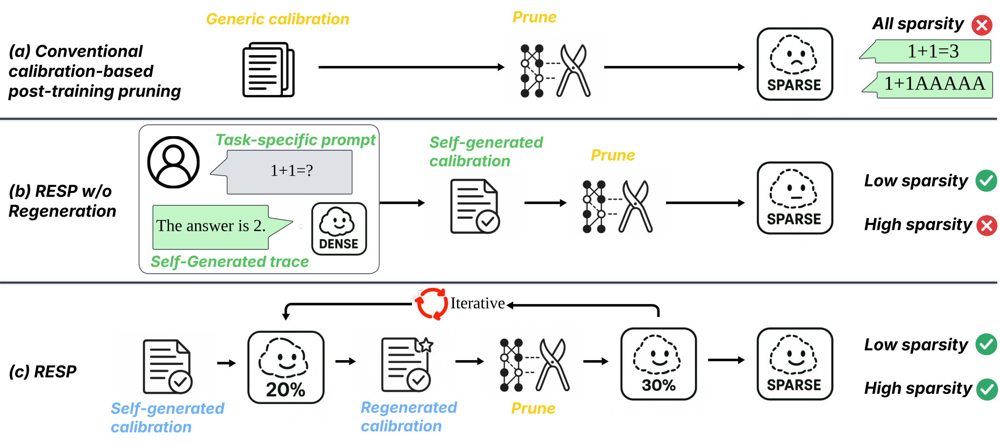
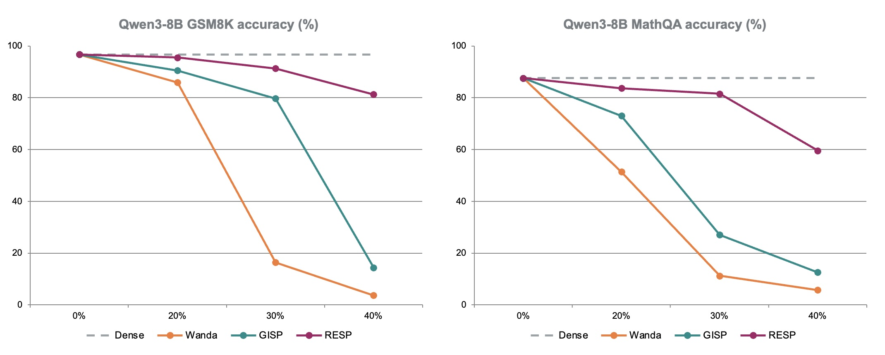

# RESP: Think Before You Prune

**Think Before You Prune: Self-Reflective Structured Pruning for Reasoning Language Models**

Ziyan Wang<sup>1</sup>, Enmao Diao<sup>2</sup>, Qi Le<sup>3</sup>,
Pu Wang<sup>1</sup>, Guanchu Wang<sup>1</sup>, Minwoo Lee<sup>1</sup>,
Shu-ping Yeh<sup>4</sup>, Li Yang<sup>1</sup>

<sup>1</sup> University of North Carolina at Charlotte ·
<sup>2</sup> DreamSoul ·
<sup>3</sup> University of Minnesota ·
<sup>4</sup> Intel Corporation

Published at [**DAC 2026**](https://63dac.conference-program.com/presentation/?id=RESEARCH2650&sess=sess176).

[Paper](https://arxiv.org/abs/2512.02185)

We introduce **RESP**, a structured pruning method that uses a reasoning model's
own generated solutions to identify which attention heads and MLP channels to
prune. RESP combines three components:

1. **Self-generated calibration:** generate reasoning traces from task prompts.
2. **Decode-only importance estimation:** compute gradient importance on response
   tokens, with prompt tokens excluded from the loss.
3. **Progressive regeneration:** refresh the traces with the current pruned model
   at sparsity milestones while keeping the prompts fixed.



## Results

Accuracy (%) on Qwen3-8B, as reported in [Table 1](https://arxiv.org/pdf/2512.02185#page=6).



## Installation

Use Python 3.10 or newer and a CUDA-enabled PyTorch installation. The experiment
configurations load Qwen3-8B in bfloat16.

```bash
git clone https://github.com/uncc-efficient-ai/RESP.git
cd RESP
python -m venv .venv
source .venv/bin/activate
python -m pip install -r requirements.txt
```

The dependencies include our LM Evaluation Harness fork with the
`gsm8k_cot_sample` and `mathqa_decoding` tasks. For answer extraction and the
Table 2 milestone ablation, also install the vLLM dependencies:

```bash
python -m pip install -r requirements-extractor.txt
```

Run the following commands from the project root. Model weights and datasets
are downloaded from Hugging Face when needed.

## Quick start

Prune Qwen3-8B with RESP on GSM8K or MathQA:

```bash
python main.py --config-path configs/section5/main/resp_gsm8k.yaml
python main.py --config-path configs/section5/main/resp_mathqa.yaml
```

To inspect a configuration before loading the model:

```bash
python main.py --config-path configs/section5/main/resp_gsm8k.yaml --check-config
```

Calibration data are cached in `data/calibration/`. Each experiment writes its
configuration, pruning checkpoints, logs and evaluation results under `outputs/`.
For example, the GSM8K RESP run uses `outputs/section5_main_resp_gsm8k/`.

## Experiments

The configurations are organized by figure and experiment section. Each group
has its own calibration settings and output directories.

| Experiment | Configurations | Comparison |
| --- | --- | --- |
| Figure 2 | [configs/figure2/](configs/figure2/) | C4 versus gold GSM8K calibration for FLAP, OWL, Wanda and GISP at 20% and 30% sparsity |
| Figure 3 | [configs/figure3/](configs/figure3/) | Gold versus self-generated GSM8K calibration for Wanda and GISP at 20%, 30% and 40% sparsity |
| Section 5, Table 1 | [configs/section5/main/](configs/section5/main/) | Dense, Wanda, GISP, RESP w/o regeneration and RESP on GSM8K and MathQA |
| Section 5, Table 2 | [milestones_mathqa.yaml](configs/section5/ablations/milestones_mathqa.yaml) | Regeneration at successive pruning milestones on MathQA |
| Section 5, Table 3 | [configs/section5/ablations/](configs/section5/ablations/) | Regeneration fractions from 0 to 1 when pruning from 30% to 40% sparsity on GSM8K |

List the commands for a group:

```bash
python scripts/run_experiments.py --group figure2
python scripts/run_experiments.py --group figure3
python scripts/run_experiments.py --group section5_main
python scripts/run_experiments.py --group section5_ablations
```

Add `--run` to execute a group sequentially, for example:

```bash
python scripts/run_experiments.py --group figure3 --run
```

### Main experiments

In Section 5, Wanda and GISP use dataset-provided reasoning
(`used_config: gold-thinking`). RESP and RESP w/o regeneration use model-generated
reasoning (`used_config: thinking`). The latter keeps the initial dense-model
traces throughout pruning. Figures 2 and 3 select calibration sources separately
for each comparison.

Examples for the dense reference, a baseline and RESP without regeneration:

```bash
python main.py --config-path configs/section5/main/dense_gsm8k.yaml
python main.py --config-path configs/section5/main/wanda_gsm8k_20.yaml
python main.py --config-path configs/section5/main/gisp_gsm8k.yaml
python main.py --config-path configs/section5/main/resp_no_regen_gsm8k.yaml
```

Use the corresponding `mathqa` configurations for MathQA. Wanda has separate
20%, 30% and 40% configurations; GISP and RESP produce multiple checkpoints
during one iterative run. Select checkpoints by their measured sparsity. The
internal `task.prune.ratio` controls the pruning schedule and allocation; its
value can differ from the overall model sparsity when some blocks are protected.

### Regeneration ablations

**Table 2:** compare regeneration at pruning milestones on MathQA. This experiment
uses multiple visible CUDA devices and the answer extractor.

```bash
python main.py --config-path configs/section5/ablations/milestones_mathqa.yaml
```

**Table 3:** first run the GSM8K configuration without regeneration and select its
checkpoint closest to 30% measured sparsity. Use that same checkpoint and dense
calibration cache for all six regeneration fractions:

```bash
python main.py --config-path configs/section5/main/resp_no_regen_gsm8k.yaml

export RESP_CHECKPOINT=/absolute/path/to/sp_0.30....pth
for fraction in 000 020 040 060 080 100; do
    python main.py --config-path "configs/section5/ablations/refresh_ratio_${fraction}.yaml"
done
```

The suffixes correspond to fractions 0, 0.2, 0.4, 0.6, 0.8 and 1. Compare the
resulting checkpoints near 40% measured sparsity.

## Evaluation

| Setting | GSM8K | MathQA |
| --- | --- | --- |
| Few-shot examples | 8 | 0 |
| Maximum generated tokens | 2048 | 4096 |
| Sampling temperature | 0.6 | 0.6 |
| Random seed | 0 | 0 |

Calibration uses 500 training prompts per task, with a 2048-token cap for
generated traces. Evaluation and trace generation use `do_sample: true`.

### Evaluate a pruning checkpoint

The `sp_*.pth` checkpoints contain pruning masks and state. The evaluation worker
loads Qwen3-8B and applies the saved masks before running the benchmark:

```bash
python -m modules.eval.parallel_lm_eval \
    --config_path configs/section5/main/resp_gsm8k.yaml \
    --checkpoint_path /absolute/path/to/sp_0.40....pth \
    --result_name resp_40 \
    --out outputs/resp_40_result_path.json
```

`--out` writes a JSON file containing the path to the evaluation results, which
include the generated responses. For evaluation on multiple GPUs, launch the
worker through Accelerate:

```bash
python -m accelerate.commands.launch --num_processes 2 \
    --module modules.eval.parallel_lm_eval \
    --config_path configs/section5/main/resp_gsm8k.yaml \
    --checkpoint_path /absolute/path/to/sp_0.40....pth \
    --result_name resp_40 \
    --out outputs/resp_40_result_path.json
```

### Extract answers

We use `Qwen/Qwen3-30B-A3B-Instruct-2507` to score the generated responses. Pass
the evaluation JSON containing the responses to the corresponding extractor:

```bash
python -m modules.eval.answer_extract_gsm8k --json_path /path/to/gsm8k_results.json
python -m modules.eval.answer_extract_mathqa --json_path /path/to/mathqa_results.json
```

The scripts start a local vLLM server and write accuracy statistics to
`*_stats.json`. Run extraction after the pruning or evaluation process exits to
make GPU memory available. Set `--vllm_tp` to the number of GPUs used for the
extractor. To use an existing compatible server, set `OPENAI_BASE_URL` and pass
`--no_launch_vllm`.

## Citation

```bibtex
@misc{wang2025thinkpruneselfreflectivestructured,
      title={Think Before You Prune: Self-Reflective Structured Pruning for Reasoning Language Models},
      author={Ziyan Wang and Enmao Diao and Qi Le and Pu Wang and Guanchu Wang and Minwoo Lee and Shu-ping Yeh and Li Yang},
      year={2025},
      eprint={2512.02185},
      archivePrefix={arXiv},
      primaryClass={cs.CL},
      url={https://arxiv.org/abs/2512.02185},
}
```

## License

The code is released under the [Apache License 2.0](LICENSE).
